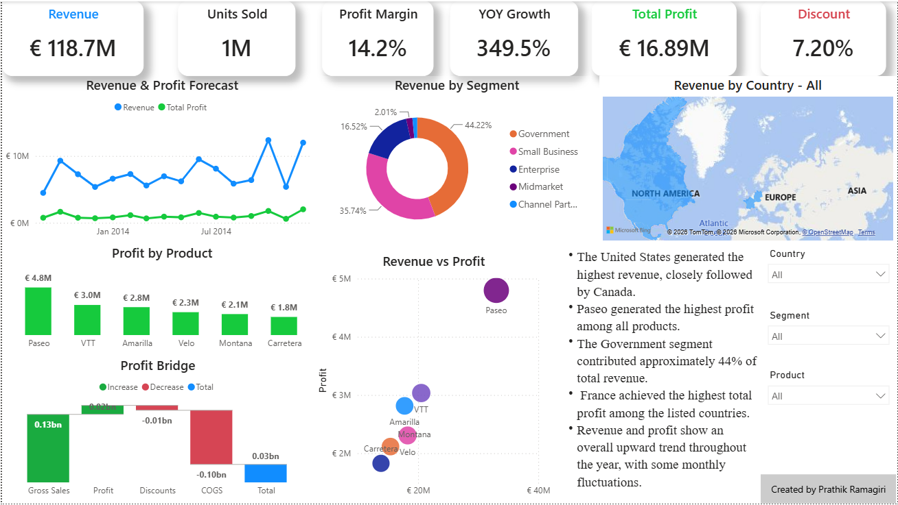

# 💰 Finance Analytics Dashboard | Power BI

An interactive **Finance Analytics Dashboard** built in **Power BI** to analyze revenue, profitability, sales performance, and business segments. The dashboard provides executives and business stakeholders with actionable insights through interactive visualizations, advanced DAX measures, and financial KPIs.

---

## 📸 Dashboard Preview



---

## 📌 Project Overview

This dashboard helps analyze financial performance across different countries, products, and business segments. It enables decision-makers to monitor key financial metrics, evaluate profitability, and identify business trends using interactive reports.

---

## 📊 Key Performance Indicators (KPIs)

- 💶 Total Revenue
- 💰 Total Profit
- 📦 Units Sold
- 📈 Profit Margin
- 📉 Discount Percentage
- 🚀 Year-over-Year (YoY) Growth

---

## 📈 Dashboard Features

### Executive KPIs
- Revenue
- Total Profit
- Profit Margin
- Units Sold
- Discount %
- YoY Growth

### Financial Analysis
- Revenue & Profit Trend
- Revenue by Business Segment
- Revenue by Country
- Profit by Product
- Revenue vs Profit Analysis
- Profit Bridge (Waterfall Chart)

### Interactive Features
- Country Filter
- Segment Filter
- Product Filter
- Dynamic KPIs
- Interactive Visualizations

---

## 🛠️ Power BI Features Used

### Power Query
- Data Cleaning
- Data Type Conversion
- Duplicate Removal
- Null Value Validation

### DAX Measures
- Revenue
- Total Profit
- Gross Sales
- Units Sold
- Profit Margin
- Average Selling Price
- Discount %
- YTD Revenue
- Previous Year Revenue
- YoY Growth

### Visualizations
- KPI Cards
- Line Chart
- Donut Chart
- Scatter Plot
- Waterfall Chart
- Map Visual
- Interactive Slicers

---

## 📂 Dataset

**Dataset:** Microsoft Financial Sample Dataset

The dataset contains:

- Date
- Country
- Product
- Segment
- Sales
- Profit
- Gross Sales
- Discounts
- Units Sold
- Manufacturing Price

---

## 💡 Business Insights

- 🇺🇸 The United States generated the highest revenue, closely followed by Canada.
- 💵 Paseo generated the highest profit among all products.
- 🏛️ Government contributed approximately **44%** of total revenue.
- 📈 Revenue and profit showed an overall upward trend throughout the year.
- 💸 Discount analysis helped evaluate its impact on profitability.

---

## 🧮 DAX Concepts Implemented

- CALCULATE()
- DIVIDE()
- TOTALYTD()
- SAMEPERIODLASTYEAR()
- SUM()
- Dynamic Measures
- Time Intelligence

---

## 🛠️ Tools & Technologies

- Microsoft Power BI
- Power Query
- DAX
- Microsoft Excel

---

## 🎯 Learning Outcomes

Through this project, I learned:

- Financial KPI reporting
- Executive dashboard design
- Time Intelligence in DAX
- Profitability analysis
- Business storytelling using Power BI
- Interactive dashboard development

---

## 📁 Repository Structure

```
Finance-Analytics-Dashboard/
│
├── Finance Analytics Dashboard.pbix
├── Dashboard.png
├── Financial Sample.xlsx
└── README.md
```

---

## 👨‍💻 Author

**Prathik Ramagiri**

🎓 Master's in Artificial Intelligence for Smart Sensors and Actuators

📍 Germany

**Skills**
- Power BI
- SQL
- DAX
- Power Query
- Python
- Tableau

---

⭐ If you found this project helpful, feel free to star the repository!
